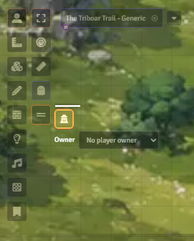

# Token Control Dock

Token Control Dock is a small Foundry VTT module that provides a selected-token dock and a public API for other modules.

It appears beside the Scene Controls when tokens are selected and at least one registered control is visible. It does not replace the Token HUD, does not patch the Token HUD, and is not Token Action HUD. It is shared infrastructure for modules that want to add context-aware controls for the current token selection.

## Compatibility

- Foundry VTT v14 primary
- Foundry VTT v13 compatible
- No v12 support
- System-agnostic

## Installation

Install the module in Foundry with this manifest URL:

```text
https://github.com/RightAsGame/token-control-dock-rail/releases/latest/download/module.json
```

Enable **Token Control Dock** in Manage Modules, and reload the world.

The module does not provide built-in token action buttons. Other modules, or console test scripts, register controls through `game.tokenControlDock`.

## Example Modules

Token Control Dock is a shared anchor for other modules. The dock button itself is the native Scene Controls tool with the grip-lines icon; buttons beneath it are registered by dependent modules.



In the example above, the stacked buttons are provided by separate modules:

- **Token Disposition Changer** contributes the disposition toggle button.
- **Token Owner Selector** contributes the owner toggle button and ownership selector.

These are examples of consuming modules. Token Control Dock only provides the selected-token anchor, layout, and registration API.

## User Notes

The dock is visible only when:

- the module setting **Token Control Dock | Show Dock** is enabled,
- the canvas is ready,
- one or more tokens are selected,
- a selected-token dock context is active.

Client settings are available for showing the dock, showing the header, compact mode, and fallback positioning.

## Developer Usage

Register a control after the API is ready:

```js
Hooks.once("tokenControlDockApiReady", api => {
  api.registerControl({
    id: "debug-log-selection",
    moduleId: "my-module",
    title: "Log Selection",
    icon: "fa-solid fa-bug",
    group: "Debug",
    order: 10,
    visible: ({ selectionCount }) => selectionCount > 0,
    onClick: ({ tokens }) => console.log("Selected tokens:", tokens)
  });
});
```

Late registration also works:

```js
game.tokenControlDock?.registerControl({
  id: "hello",
  moduleId: "my-module",
  title: "Hello",
  label: "Hello",
  onClick: ({ selectionCount }) => console.log(`${selectionCount} selected`)
});
```

For full integration requirements, see [docs/INTEGRATION.md](docs/INTEGRATION.md).

## Troubleshooting

- Dock does not appear: select a token, enable **Show Dock**, and confirm at least one control is registered and visible.
- Control does not appear: its `visible` callback may be returning false or throwing.
- Button is disabled: its `enabled` callback may be returning false or throwing.
- Dock appears in the wrong place: fallback positioning may be active because Scene Controls were not found.

## License

MIT
